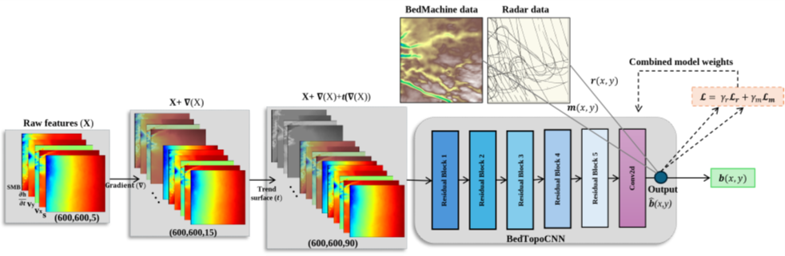
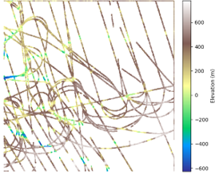
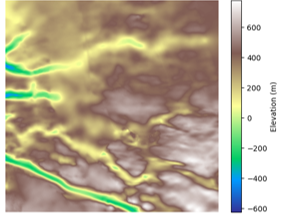

# DeepTopoNet: Deep Learning for Bed Topography Estimation

<p align="center">
  
</p>

This repository provides a PyTorch-based implementation of **DeepTopoNet**, a convolutional neural network designed for subglacial bed topography prediction using surface-derived features. The model leverages radar data (`data_full.csv`), BedMachine-derived priors (`bed_BedMachine.h5`), and hybrid loss terms to improve bed elevation reconstruction in regions with sparse observational data.
A sample of radar data and BedMachine data is shown below.

<p align="center">
  
  
</p>


## 🔧 Input Features

- Multi-modal feature integration: surface velocity, elevation, SMB, and dh/dt
- Gradient and trend surface augmentation to improve spatial modeling
- Hybrid loss combining radar-supervised and BedMachine-regularized terms
- Patch-based training using radar mask supervision

## 🚀 How to Run

1. Install dependencies:
    ```bash
    pip install torch numpy pandas h5py
    ```
2. Prepare the `data/` folder:
    - Place the following files in `./data/`:
      - `hackathon.h5`
      - `bed_BedMachine.h5`
      - `data_full.csv`
3. Train the model:
    ```bash
    python train_deeptoponet.py
    ```
Model checkpoints will be saved in `./saved_models/`.

## 📜 Citation
Bayu Adhi Tama, Mansa Krishna, Homayra Alam, Mostafa Cham, Omar Faruque, Gong Cheng, Jianwu Wang, Mathieu Morlighem, Vandana Janeja.  
**DeepTopoNet: A Framework for Subglacial Topography Estimation on the Greenland Ice Sheets.**  
arXiv:2505.23980 [cs.CV], 2025. [https://doi.org/10.48550/arXiv.2505.23980](https://doi.org/10.48550/arXiv.2505.23980)
(accepted as a Full Application Paper Track at **SIGSPATIAL 2025**)
